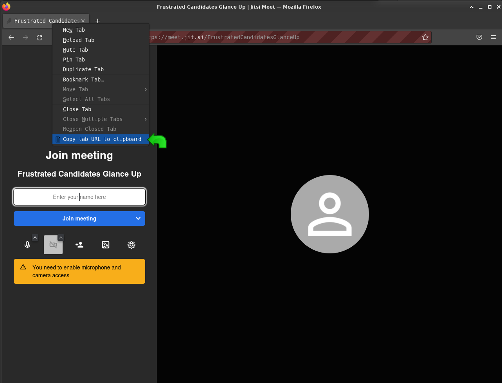

# Copy-Tab-URL

Copy Tab URL WebExtension for at least Firefox.
This extension allows you to copy the URL of a tab by right-clicking on the tab and selecting "Copy Tab URL".

Note: This extension only works if the tab is already loaded.
If it is not loaded yet, as in some cases like if the browser crashed and the tabs were restored, but not reloaded, then the URL will be undefined.
It is not apparent if it is possible to work around this limitation.
The workaround is to allow the tab to load by clicking on it.

- 